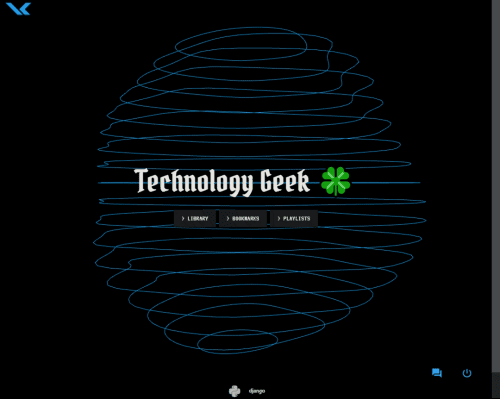
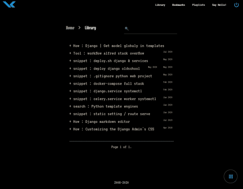
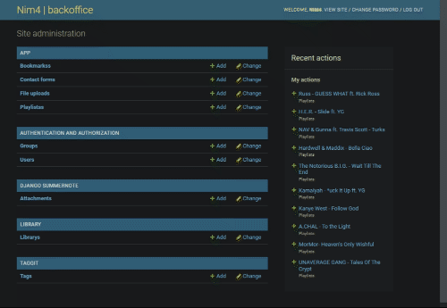

### https://NIM4.me
`Update @ Jan 2022`<br>
[](https://github.com/nim444/nim4.me/actions/workflows/django.yml) 
<br>


 Personal website powered by Django pythonic web framework .


<br>
<br>



___
``` 
|       Features       | ______ |    Stacks    |
|:--------------------:|--------|:------------:|
| RestAPI Endpoint     | ------ | Python  +3.6 |
| Import , Export      | ------ | Django  +3.0 |
| WYSIWYG Text Editor  | ------ | Gunicorn     |
| HTML, JS. CSS Minify | ------ | Nginx        |
| Dev . Prod Staging   | ------ | PostgreSQL   |
| Google Analytics     | ------ |--------------+
| Django CI            | ------ | 
| Configparser         |_______/ 
```

```
### Project Tree
.                                               # Project root 
├── LICENSE                                     # MIT License
├── .github                                     # Github actions
│   ├── workflows                               # Django CI action     
├── nim4                                        # Django Project
│   ├── api                                     # ------- API App *
│   │   ├── apps.py                             # API AppConfig
│   │   ├── serializers.py                      # Serializers define the API representation.
│   │   └── urls.py                             # API Urls ,Wire up our API using automatic URL routing.
│   ├── app                                     # ------- Core App *
│   │   ├── admin.py                            # Django Admin model views - Model:app
│   │   ├── apps.py                             # App AppConfig
│   │   ├── models.py                           # Models schema  django ORM
│   │   ├── static                              # App statics file
│   │   ├── templates                           # App Template directory
│   │   ├── urls.py                             # URL Patterns
│   │   ├── utils.py                            # Utils . get_client_ip()
│   │   └── views.py                            # Views : HomeView , 404, BookmarksListView, ....
│   ├── library                                 # ------- Library App *
│   │   ├── admin.py                            # Django admin model views - Model:library
│   │   ├── apps.py                             # Library AppConfig
│   │   ├── models.py                           # Models schema  django ORM
│   │   ├── templates                           # Library Template directory
│   │   ├── urls.py                             # URL Patterns
│   │   └── views.py                            # Views: LibraryListView,LibraryDetailView, ....
│   ├── manage.py                               # MANAGMENT CLI - runserver , makemigrations , migrate , ....
│   ├── media                                   # Media upload directory 
│   ├── new_req.txt                             # requariments file update
│   ├── requariments.txt                        # requariments file unclean
│   ├── nim4                                    # ------- Project main  *
│   │   ├── asgi.py                             # ASGI config 
│   │   ├── settings                            # Project settings directory
│   │   │   ├── __init__.py                     # Switching settings BASE / PRODUCTION
│   │   │   ├── base.py                         # BASE config
│   │   │   ├── prod.py                         # PRODUCTION config
│   │   ├── urls.py                             # URL Patterns
│   │   └── wsgi.py                             # WSGI config
│   └── templates                               # General templates
└── readme.MD
 ```